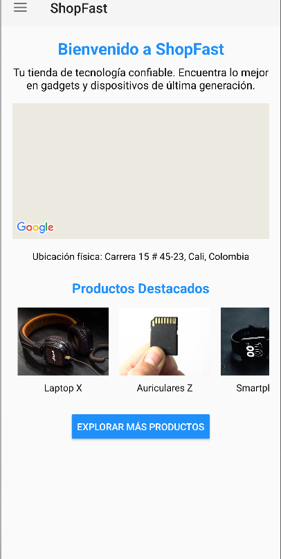
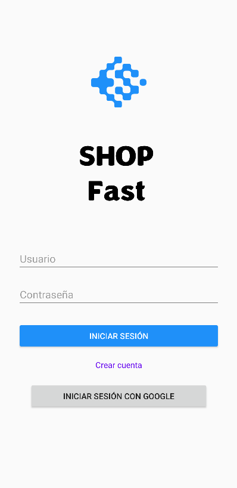
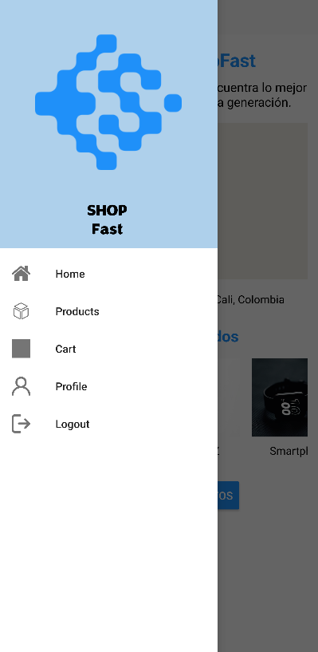
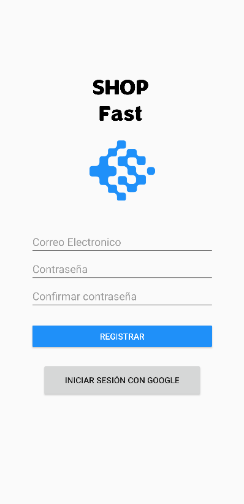

# ShopFast

## Descripción del Proyecto

**ShopFast** es una aplicación móvil desarrollada en Java para dispositivos Android que permite a los usuarios explorar, gestionar y realizar compras simuladas en una tienda de tecnología. La aplicación está diseñada con interfaces gráficas intuitivas que incluyen pantallas para inicio de sesión, lista de productos, carrito de compras y registro de clientes. Además, utiliza una base de datos local SQLite para la gestión de datos de los productos.

## Características

- **Interfaz de usuario funcional**: Pantallas diseñadas para login, listado de productos, carrito de compras y registro de clientes.
- **Gestión de base de datos local**: Uso de SQLite para almacenar información sobre productos.
- **Simulación de compras**: Permite agregar productos al carrito y visualizar detalles.
- **Integración con Google Maps API**: Visualización de la ubicación física de la tienda.
- **Inicio de sesión con Google**: Autenticación con la API de Gmail para una experiencia más segura.
- **Compatibilidad nativa**: Desarrollada utilizando Android Studio para dispositivos Android.

## Requisitos Previos

- **IDE**: [Android Studio](https://developer.android.com/studio)
- **Versión mínima de Android**: 5.0 (API 21)
- **Herramientas necesarias**:
  - Java Development Kit (JDK)
  - Google Play Services
  - Clave de API de Google Maps

## Instalación

1. Clona este repositorio:
   ```bash
   git clone https://github.com/tu_usuario/shopfast.git
   cd shopfast

2. Abre el proyecto en Android Studio:

    Selecciona File > Open y selecciona la carpeta del proyecto.

3. Configura las claves de API:

    Obtén una clave API de Google para Maps y Gmail.
    Configura las claves en el archivo google_maps_api.xml dentro de res/values.

4. Sincroniza las dependencias:

    Asegúrate de que el archivo build.gradle esté actualizado y sincronízalo.

5. Ejecuta la aplicación:

    Conecta un dispositivo Android o utiliza un emulador para ejecutar el proyecto.

   
## Uso

1. Inicia la aplicación:

    Al abrir la aplicación, el usuario es llevado a la pantalla de inicio de sesión.

2. Explora los productos:

    Después de iniciar sesión, puedes navegar por la lista de productos disponibles.

3. Gestiona tu carrito:

    Agrega productos al carrito y revisa los detalles antes de proceder.

4. Consulta la ubicación de la tienda:

    Usa el mapa integrado para encontrar la ubicación física de la tienda.
   

## Android Screenshots

  Home                 |    Login       
:-------------------------:|:-------------------------:
 | 

  Menu Drawer                |    Register       
:-------------------------:|:-------------------------:
 | 

## Estructura del Proyecto
```sh
|-- app
|   |-- src
|   |   |-- main
|   |   |   |-- java/com/neyrisbh/shopfast
|   |   |   |   |-- activities
|   |   |   |   |   |-- LoginActivity.java
|   |   |   |   |   |-- HomeActivity.java
|   |   |   |   |   |-- ProductListActivity.java
|   |   |   |   |   '-- CartActivity.java
|   |   |   |   |-- models
|   |   |   |   |   '-- Product.java
|   |   |   |   |-- helpers
|   |   |   |       '-- DatabaseHelper.java
|   |   |   |-- res
|   |   |       |-- layout
|   |   |       |   |-- activity_login.xml
|   |   |       |   |-- activity_home.xml
|   |   |       |   |-- activity_product_list.xml
|   |   |       |   '-- activity_cart.xml
|   |   |       |-- drawable
|   |   |       '-- values
|   |   |           |-- strings.xml
|   |   |           '-- google_maps_api.xml
|   |   '-- AndroidManifest.xml
|-- build.gradle
|-- README.md
